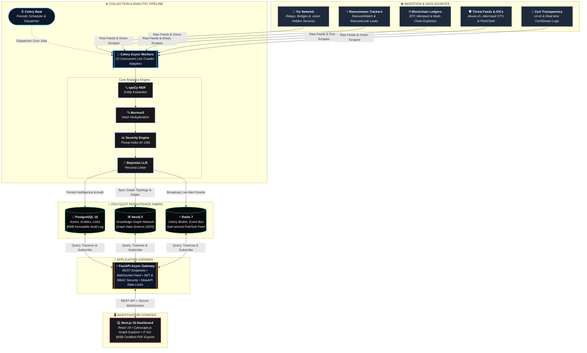
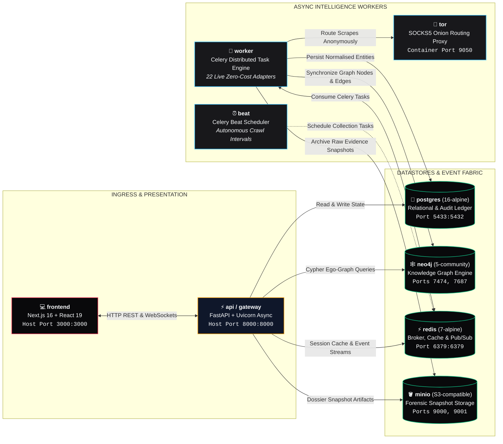
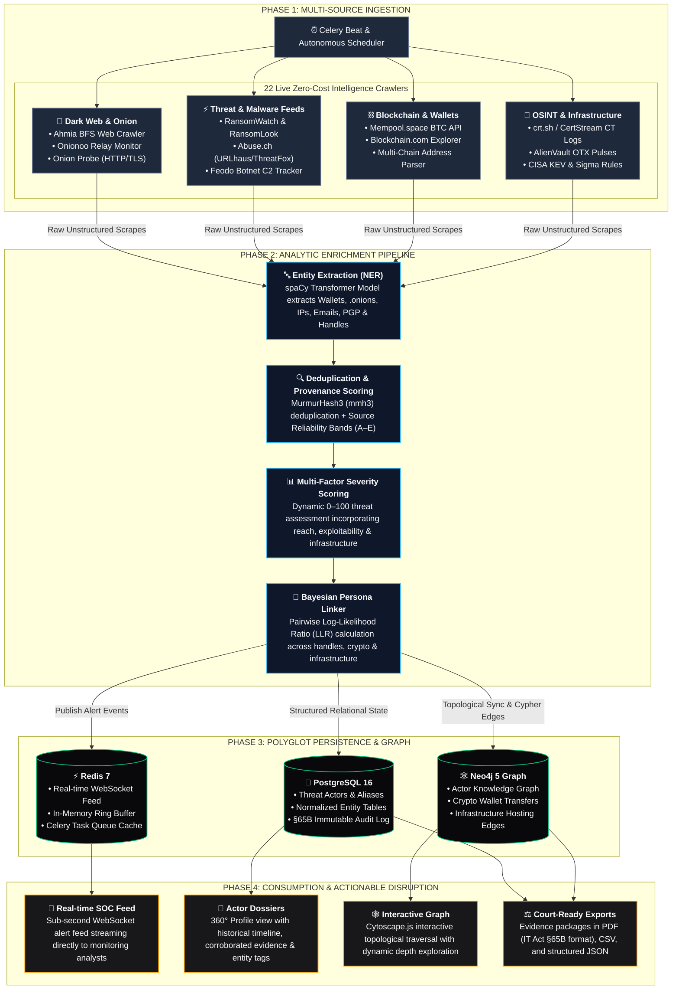
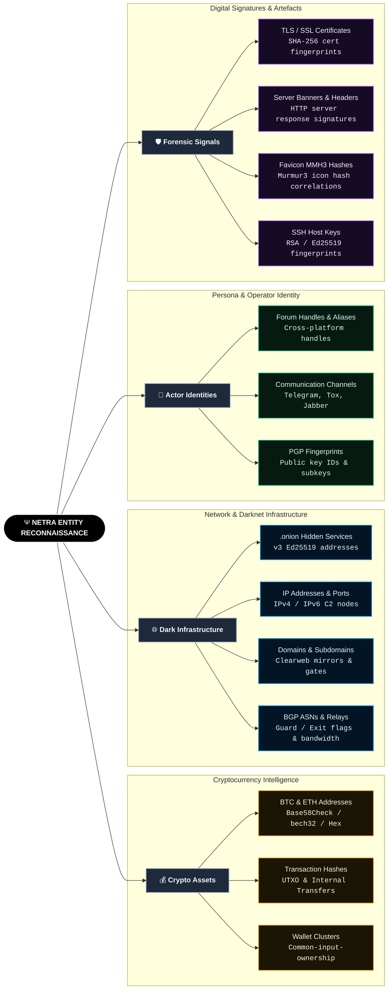
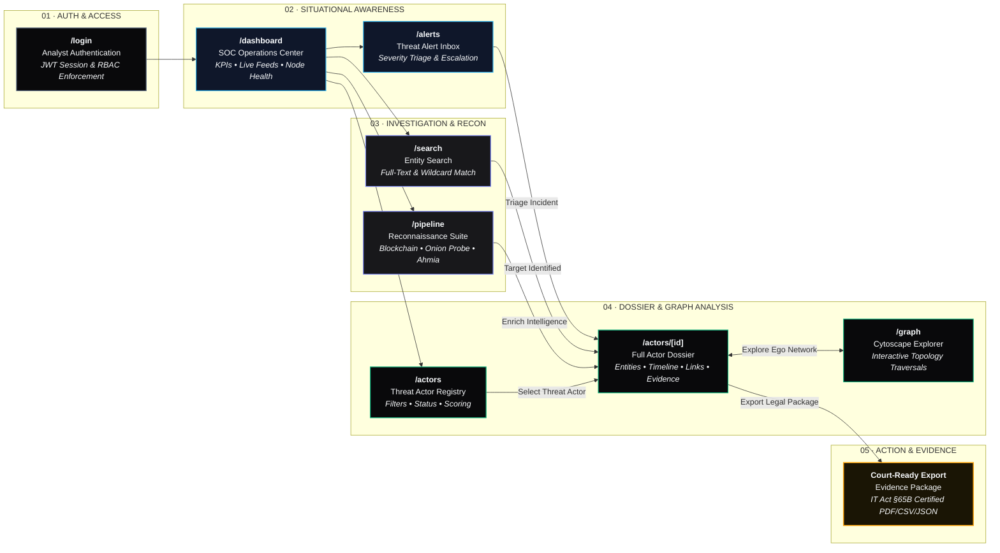
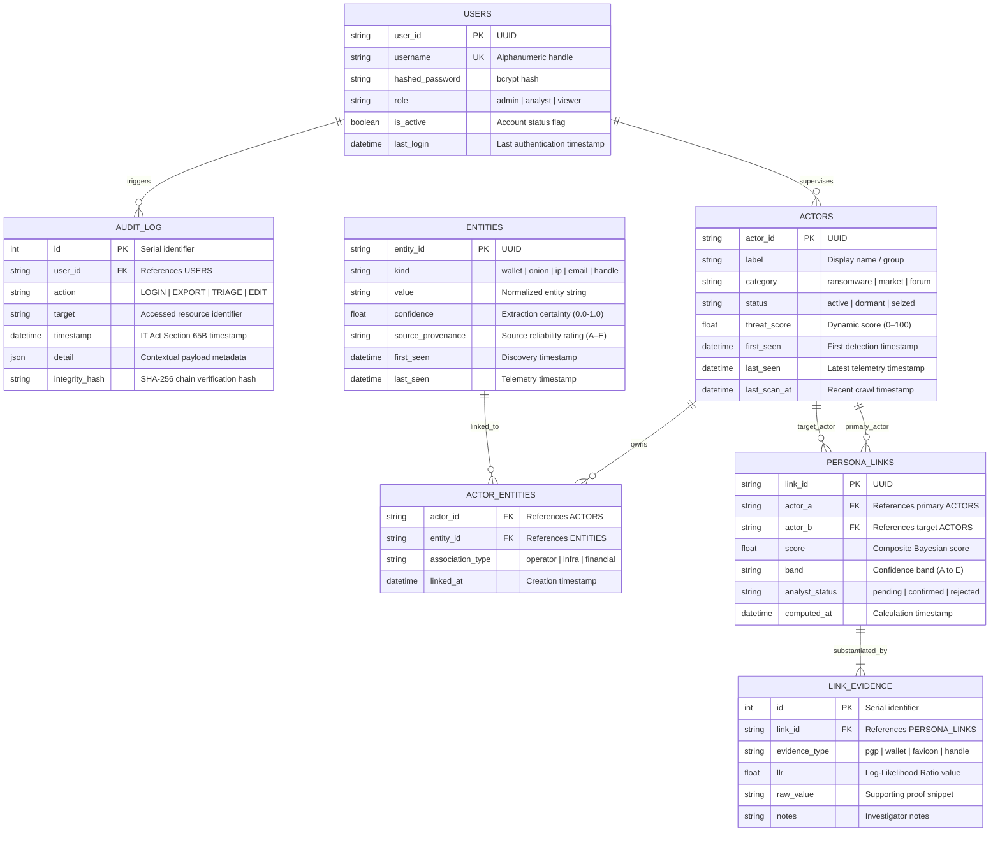
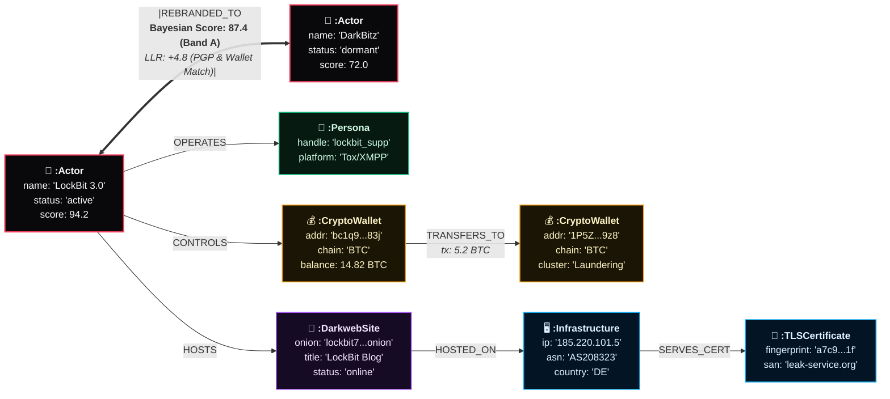
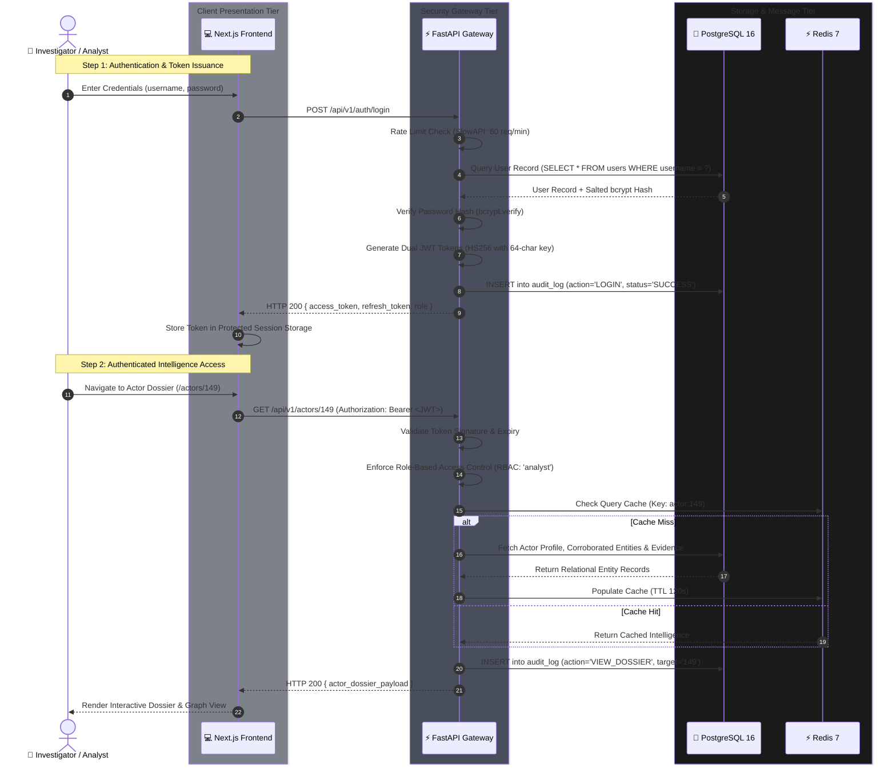
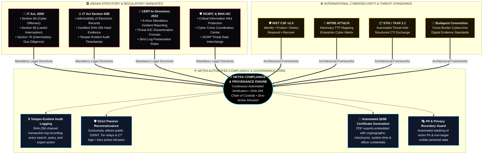

<p align="center">
  
  
  
  
  
</p>

<br/>

<h1 align="center">
  <code>Ψ</code> NETRA
</h1>

<p align="center">
  <strong>Networked Entity Tracking & Reconnaissance Architecture</strong>
</p>

<p align="center">
  <em>Automated Dark Web Intelligence & Threat Disruption Platform for Law Enforcement</em>
</p>

<p align="center">
  <code>━━━━━━━━━━━━━━━━━━━━━━━━━━━━━━━━━━━━━━━━━━━━━━━━━━━━━━</code>
</p>

<p align="center">
  <sub>
    22 live crawlers · 23,000+ intelligence items · Real-time graph analysis · Court-ready exports
  </sub>
</p>

<br/>

---

## Table of Contents

```
 00 ─── Overview
 01 ─── Problem Statement
 02 ─── Architecture
 03 ─── Data Flow Pipeline
 04 ─── System Components
 05 ─── Intelligence Adapters (22 Crawlers)
 06 ─── API Reference
 07 ─── Frontend Pages
 08 ─── Database Schema
 09 ─── Security & Compliance
 10 ─── Quick Start
 11 ─── Environment Variables
 12 ─── Make Targets
 13 ─── Project Structure
 14 ─── Tech Stack
 15 ─── Data Sources & References
 16 ─── License
```

---

## `00` Overview

**NETRA** is an end-to-end dark web intelligence platform that automates the entire threat intelligence lifecycle — from raw data collection on Tor hidden services, ransomware trackers, and blockchain explorers to structured analysis, persona linking, and court-admissible evidence generation.

Built for Indian law enforcement agencies (CERT-In, NIA, State Cyber Cells), NETRA operates exclusively on **open-source intelligence (OSINT)** and public APIs. No unauthorized access is ever performed.

```
┌─────────────────────────────────────────────────────────────┐
│                                                             │
│    "Eyes where darkness hides"                              │
│                                                             │
│    NETRA sees what traditional tools can't:                 │
│    ▸ Anonymous dark web actors                              │
│    ▸ Cryptocurrency money flows                             │
│    ▸ Hidden service infrastructure                          │
│    ▸ Cross-platform persona links                           │
│                                                             │
└─────────────────────────────────────────────────────────────┘
```

### Key Capabilities

| Capability | Description |
|:-----------|:------------|
| **22 Live Crawlers** | Zero-cost public data adapters — no API keys required |
| **Real-time Monitoring** | WebSocket event feed with severity-scored alerts |
| **Graph Intelligence** | Neo4j-powered relationship mapping (actors ↔ wallets ↔ infrastructure) |
| **Persona Linking** | Bayesian evidence model connecting anonymous handles across platforms |
| **Blockchain Analysis** | BTC/ETH address tracking, transaction flow, wallet clustering |
| **Court-ready Exports** | PDF, CSV, JSON evidence packages (IT Act §65B compliant) |
| **Dockerized Deployment** | Single `docker compose up` — 6 services, under ₹5,000/month |

---

## `01` Problem Statement

> **SIH 2025 — Problem ID: 26151**

India faces an escalating dark web threat landscape:

```
  16,00,000+   cybercrime complaints annually (NCRP 2023-24)
  67%          of ransomware attacks involve dark web forums (CERT-In)
  $1.7B        dark web marketplace revenue in 2023 (Chainalysis)
  14 months    average law enforcement dark web investigation (Europol)
```

**The gap:** No unified Indian platform exists to correlate dark web actors, cryptocurrency wallets, and hidden infrastructure in real-time. Existing tools (Recorded Future, DarkOwl) cost $200K-$500K/year and aren't built for Indian law enforcement workflows.

**NETRA bridges this gap** at a fraction of the cost, with India-first compliance (IT Act, CERT-In, NCIIPC).

---

## `02` Architecture



### Docker Service Topology



---

## `03` Data Flow Pipeline



### Entity Types Extracted



---

## `04` System Components

### Backend (`backend/app/`)

```
backend/app/
├── main.py              # FastAPI application factory, CORS, lifespan
├── config.py            # Pydantic settings (env-driven configuration)
│
├── api/                 # REST + WebSocket endpoints
│   ├── auth.py          # JWT login, registration, token refresh
│   ├── actors.py        # CRUD actors, graph queries, persona links
│   ├── pipeline.py      # Trigger collections, blockchain/onion lookups
│   ├── routes.py        # Search, alerts, timeline, watchlist, infra
│   ├── exports.py       # PDF/CSV/JSON export with raw PDF generator
│   ├── health.py        # System health, Redis/Neo4j/Postgres checks
│   ├── sources.py       # Data source registry and status
│   ├── websocket.py     # Real-time event feed via WebSocket
│   └── deps.py          # Dependency injection (DB sessions, auth)
│
├── adapters/            # 22 intelligence collection adapters
│   ├── base.py          # Abstract base adapter interface
│   ├── http_client.py   # Shared HTTP client with retry/backoff
│   ├── ransomware_tracker.py
│   ├── abuse_ch.py
│   ├── tor_network.py
│   ├── onion_probe.py
│   ├── onion_crawler.py
│   ├── blockchain.py
│   ├── cert_transparency.py
│   ├── osint_feeds.py
│   ├── detection_rules.py
│   ├── source_provenance.py
│   ├── supplementary.py
│   ├── archives.py
│   └── replay.py        # Replay recorded data for demos
│
├── models/              # SQLAlchemy ORM models
│   ├── actors.py        # Actor, ActorEntity, PersonaLink, LinkEvidence, AuditLog
│   ├── entities.py      # Entity (wallets, handles, IPs, PGP keys, onions)
│   └── base.py          # Declarative base
│
├── core/                # Security, auth, events
│   ├── security.py      # JWT, bcrypt, RBAC, AuditAction enum
│   └── events.py        # Startup/shutdown lifecycle hooks
│
├── graph/               # Neo4j graph operations
│   └── schema.py        # Graph session, actor ego-graph queries
│
├── extraction/          # NLP entity extraction
│   └── ner.py           # spaCy NER pipeline
│
├── analytics/           # Scoring and analysis
│   └── scoring.py       # Severity scoring, confidence bands
│
└── workers/             # Celery async workers
    ├── celery_app.py    # Celery configuration
    └── tasks.py         # Collection & processing tasks
```

### Frontend (`frontend/src/`)

```
frontend/src/
├── app/
│   ├── layout.tsx       # Root layout with Material Symbols
│   ├── page.tsx         # Redirect to /dashboard
│   ├── globals.css      # NETRA design system (tokens, typography)
│   ├── login/           # JWT authentication page
│   ├── dashboard/       # Real-time overview, KPIs, live feed
│   ├── actors/          # Actor registry + detail dossier view
│   ├── graph/           # Cytoscape.js interactive graph explorer
│   ├── alerts/          # Severity-triaged alert inbox
│   ├── pipeline/        # Collection triggers, blockchain/onion lookups
│   └── search/          # Full-text entity search
│
├── components/
│   ├── AppLayout.tsx    # Sidebar + TopBar wrapper
│   ├── Sidebar.tsx      # Navigation + New Dossier modal
│   └── TopBar.tsx       # Search, export dropdown, notifications
│
└── lib/
    └── api.ts           # Type-safe API client (actors, pipeline, exports)
```

---

## `05` Intelligence Adapters (22 Crawlers)

All adapters are zero-cost, requiring no API keys or paid subscriptions.

| # | Adapter | Source | Data Collected |
|:--|:--------|:-------|:---------------|
| 1 | `ransomware_tracker` | RansomWatch | Ransomware group names, leak sites, victim data |
| 2 | `ransomware_tracker` | RansomLook | Negotiation leaks, group profiles |
| 3 | `abuse_ch` | Feodo Tracker | Botnet C2 server IPs and ports |
| 4 | `abuse_ch` | URLhaus | Malware distribution URLs |
| 5 | `abuse_ch` | ThreatFox | IOCs (IPs, domains, hashes) |
| 6 | `abuse_ch` | MalBazaar | Malware sample metadata |
| 7 | `tor_network` | Onionoo | Tor relay/bridge fingerprints, bandwidth, flags |
| 8 | `onion_probe` | Direct .onion | HTTP status, TLS certs, server banners, favicon hashes |
| 9 | `onion_crawler` | Ahmia + BFS | Dark web page content, links, screenshots |
| 10 | `blockchain` | Mempool.space | BTC transactions, address balances, fee estimates |
| 11 | `blockchain` | Blockchain.com | BTC address history, multi-address lookup |
| 12 | `cert_transparency` | crt.sh | Certificate issuance for domain/actor infrastructure |
| 13 | `cert_transparency` | CertStream | Real-time CT log stream |
| 14 | `osint_feeds` | AlienVault OTX | Threat pulses, IOC feeds |
| 15 | `osint_feeds` | PhishTank | Verified phishing URLs |
| 16 | `detection_rules` | Sigma Rules | SIEM detection rules for alert generation |
| 17 | `detection_rules` | CISA KEV | Known exploited vulnerabilities |
| 18 | `supplementary` | DShield (SANS) | Top attacking IPs |
| 19 | `supplementary` | GreyNoise | Internet scanner/noise classification |
| 20 | `supplementary` | BGP Ranking (CIRCL) | ASN reputation scoring |
| 21 | `source_provenance` | Internal | Data lineage, source reliability scoring (A-E bands) |
| 22 | `archives` | Wayback Machine | Historical snapshots of dark web pages |

---

## `06` API Reference

**Base URL:** `http://localhost:8000/api/v1`

### Authentication

| Method | Endpoint | Description |
|:-------|:---------|:------------|
| `POST` | `/auth/login` | JWT login → `{ access_token }` |
| `POST` | `/auth/register` | Create analyst account |
| `POST` | `/auth/refresh` | Refresh JWT token |

### Actors

| Method | Endpoint | Description |
|:-------|:---------|:------------|
| `GET` | `/actors` | List actors (filterable by status, category, search) |
| `POST` | `/actors` | Create new actor dossier |
| `GET` | `/actors/{id}` | Full actor profile with entities & links |
| `PATCH` | `/actors/{id}` | Update actor fields |
| `GET` | `/actors/{id}/graph` | Ego-graph (depth-configurable) |
| `GET` | `/actors/graph/overview` | Full knowledge graph for explorer |
| `GET` | `/actors/links/{id}/evidence` | Evidence chain for persona link |
| `POST` | `/actors/links/{id}/review` | Analyst confirms/rejects link |

### Pipeline & Collection

| Method | Endpoint | Description |
|:-------|:---------|:------------|
| `POST` | `/pipeline/collect` | Trigger single source collection |
| `POST` | `/pipeline/collect/all` | Trigger all 22 adapters |
| `POST` | `/pipeline/lookup/blockchain` | BTC/ETH address lookup |
| `POST` | `/pipeline/lookup/probe` | .onion URL probe |
| `POST` | `/pipeline/lookup/crawl` | Ahmia keyword crawl |
| `GET` | `/pipeline/status` | Collection run status |

### Search & Alerts

| Method | Endpoint | Description |
|:-------|:---------|:------------|
| `GET` | `/search?q=` | Full-text search across actors & entities |
| `GET` | `/alerts` | Severity-scored alert feed |
| `POST` | `/alerts/{id}/triage` | Mark alert as triaged/escalated |
| `GET` | `/timeline/{actor_id}` | Actor activity timeline |

### Exports

| Method | Endpoint | Formats |
|:-------|:---------|:--------|
| `POST` | `/exports/intel` | JSON, CSV, **PDF** — full intelligence package |
| `POST` | `/exports/batch` | JSON, CSV — all actors |
| `POST` | `/exports/dossier` | JSON, CSV, **PDF** — single actor dossier |

### System

| Method | Endpoint | Description |
|:-------|:---------|:------------|
| `GET` | `/health` | Service health (Postgres, Redis, Neo4j) |
| `GET` | `/sources` | Data source registry & status |
| `WS` | `/ws/feed` | Real-time event stream (WebSocket) |

> **Interactive docs:** http://localhost:8000/docs (Swagger UI)

---

## `07` Frontend Pages

| Route | Page | Description |
|:------|:-----|:------------|
| `/login` | Authentication | JWT login with encrypted session |
| `/dashboard` | Overview | KPIs, live event feed, system status, alert summary |
| `/actors` | Actor Registry | Searchable/filterable actor list with threat scores |
| `/actors/[id]` | Actor Dossier | Full profile — entities, timeline, infra, rebrand links, evidence |
| `/graph` | Graph Explorer | Interactive Cytoscape.js knowledge graph with node inspection |
| `/alerts` | Alert Inbox | Severity-triaged alerts with triage actions |
| `/pipeline` | Pipeline Control | Trigger collections, blockchain lookup, onion probe, crawl |
| `/search` | Entity Search | Full-text search across all intelligence |

### User Journey



---

## `08` Database Schema

### PostgreSQL Schema



### Neo4j Graph Schema



### Persona Link Scoring (Bayesian LLR)

```mermaid
flowchart TD
    subgraph EVIDENCE["CORRELATED EVIDENCE INPUTS"]
        direction LR
        subgraph T1["Tier 1: Cryptographic Determinism"]
            E1["🔑 <b>PGP Fingerprint Match</b><br/><code>LLR = +5.0</code>"]
            E2["🗝️ <b>SSH Host Key Match</b><br/><code>LLR = +4.5</code>"]
            E3["⛓️ <b>Multi-Sig Wallet Co-spend</b><br/><code>LLR = +4.0</code>"]
        end

        subgraph T2["Tier 2: Infrastructure & Financial"]
            E4["💰 <b>Direct Wallet Transfer</b><br/><code>LLR = +2.8</code>"]
            E5["🧅 <b>Colocated Onion / TLS SAN</b><br/><code>LLR = +2.5</code>"]
            E6["🖼️ <b>Murmur3 Favicon Hash</b><br/><code>LLR = +2.0</code>"]
        end

        subgraph T3["Tier 3: Behavioral & Heuristics"]
            E7["👤 <b>Exact Handle Match</b><br/><code>LLR = +1.5</code>"]
            E8["📝 <b>Stylometry Vocabulary Match</b><br/><code>LLR = +1.0</code>"]
            E9["⏰ <b>Temporal Activity Overlap</b><br/><code>LLR = +0.6</code>"]
        end
    end

    subgraph ENGINE["BAYESIAN EVIDENCE ACCUMULATION ENGINE"]
        CALC["<b>Log-Likelihood Ratio Accumulator</b><br/><code>LLR_total = ∑ LLR_i</code><br/><code>Posterior Probability = 1 / (1 + e^(-LLR_total))</code>"]
    end

    subgraph BANDS["CONFIDENCE BANDS & OPERATIONAL ACTION"]
        direction LR
        B_A["🟢 <b>BAND A (Score 80–100)</b><br/><b>Verified Attribution</b><br/>• Automated entity linkage<br/>• High-priority LE alert"]
        B_B["🔵 <b>BAND B (Score 60–79)</b><br/><b>High Probability Link</b><br/>• Flagged for Analyst Confirmation<br/>• Corroboration scheduled"]
        B_C["🟡 <b>BAND C (Score 40–59)</b><br/><b>Moderate Lead</b><br/>• Displayed in exploratory graph<br/>• Awaiting further data"]
        B_DE["⚪ <b>BAND D/E (Score < 40)</b><br/><b>Low / Speculative</b><br/>• Suppressed from public dossiers<br/>• Stored for historical indexing"]
    end

    E1 & E2 & E3 -->|Tier 1: High LLR| CALC
    E4 & E5 & E6 -->|Tier 2: Medium LLR| CALC
    E7 & E8 & E9 -->|Tier 3: Heuristic LLR| CALC
    CALC --> B_A
    CALC --> B_B
    CALC --> B_C
    CALC --> B_DE

    classDef t1Style fill:#09090b,stroke:#f43f5e,stroke-width:1.5px,color:#f8fafc;
    classDef t2Style fill:#1a1505,stroke:#f59e0b,stroke-width:1.5px,color:#fef3c7;
    classDef t3Style fill:#031525,stroke:#0ea5e9,stroke-width:1.5px,color:#e0f2fe;
    classDef calcStyle fill:#0f172a,stroke:#38bdf8,stroke-width:2px,color:#f8fafc;
    classDef bandA fill:#061a12,stroke:#10b981,stroke-width:2px,color:#d1fae5;
    classDef bandB fill:#031525,stroke:#3b82f6,stroke-width:1.5px,color:#dbeafe;
    classDef bandC fill:#1a1505,stroke:#f59e0b,stroke-width:1.5px,color:#fef3c7;
    classDef bandDE fill:#18181b,stroke:#71717a,stroke-width:1px,color:#a1a1aa;

    class E1,E2,E3 t1Style;
    class E4,E5,E6 t2Style;
    class E7,E8,E9 t3Style;
    class CALC calcStyle;
    class B_A bandA;
    class B_B bandB;
    class B_C bandC;
    class B_DE bandDE;
```



---

## `09` Security & Compliance

### Authentication & Authorization Flow



### OWASP Top 10 Coverage

| OWASP ID | Threat | NETRA Mitigation |
|:---------|:-------|:-----------------|
| A01 | Broken Access Control | Strict RBAC with JWT token scopes, role-based API route guards |
| A02 | Cryptographic Failures | Salted bcrypt password hashing, JOSE/JWE encrypted token exchange |
| A03 | Injection | SQLAlchemy ORM parameterized queries, Pydantic strict payload validation |
| A04 | Insecure Design | Threat-modeled architecture, principle of least privilege across services |
| A05 | Security Misconfiguration | Docker `security_opt: [no-new-privileges:true]`, read-only filesystems |
| A07 | Auth Failures | Brute-force lockout (5 attempts / 30m), SlowAPI IP rate limiting |
| A09 | Logging & Monitoring | Immutable SHA-256 chained audit_log table, structured JSON logging |

### Legal & Regulatory Compliance



---

## `10` Quick Start

### Prerequisites

- Docker & Docker Compose
- Node.js 18+ (for frontend development)
- Python 3.12+ (for backend development)

### One-Command Launch

```bash
# Clone repository
git clone https://github.com/Swaggyop/netra.git
cd netra

# Configure environment variables
cp .env.example .env
# Edit .env with your environment-specific secrets

# Launch all 6 microservices
make up

# Run database migrations
make migrate

# Seed database with initial registry
make seed

# Generate synthetic intelligence data
make generate

# Start frontend development server
cd frontend && npm install && npm run dev
```

### Full Demo (single command)

```bash
make demo    # runs: up → migrate → seed → generate → replay
```

### Access Points

| Service | URL | Description |
|:--------|:----|:------------|
| **Dashboard** | http://localhost:3000 | Investigator Next.js UI |
| **API Docs** | http://localhost:8000/docs | Interactive Swagger UI |
| **Neo4j Browser** | http://localhost:7474 | Graph DBMS Console |
| **WebSocket Feed** | ws://localhost:8000/ws/feed | Real-time Alert Stream |

### Initial Access & Authentication Setup

> [!IMPORTANT]
> **Zero Default Passwords Policy (OWASP A07 / CERT-In Compliance)**:
> In accordance with Indian cybersecurity guidelines and secure development best practices, NETRA **does not ship with hardcoded credentials** in version control.
>
> 1. Initial administrator access is provisioned during the seed phase:
>    ```bash
>    make seed
>    ```
> 2. The seed script provisions an initial admin account and outputs development access credentials to the secure console.
> 3. For staging or production deployments, specify custom administrator credentials directly in your uncommitted `.env` file before initial boot.
> 4. **Mandatory Security Requirement**: Change default development passwords immediately upon first login via the user management profile.

---

## `11` Environment Variables

```bash
# ── Application ──────────────────────────────
APP_NAME=netra
APP_ENV=development          # development | staging | production
SECRET_KEY=<random-64-character-secret>
ALLOWED_HOSTS=localhost,127.0.0.1

# ── PostgreSQL ───────────────────────────────
POSTGRES_HOST=postgres
POSTGRES_PORT=5432           # Internal Docker network port (mapped to 5433 on host)
POSTGRES_DB=netra
POSTGRES_USER=netra
POSTGRES_PASSWORD=<strong-database-password>

# ── Neo4j ────────────────────────────────────
NEO4J_URI=bolt://neo4j:7687
NEO4J_USER=neo4j
NEO4J_PASSWORD=<strong-graph-password>

# ── Redis ────────────────────────────────────
REDIS_URL=redis://redis:6379/0
CELERY_BROKER_URL=redis://redis:6379/1
CELERY_RESULT_BACKEND=redis://redis:6379/2

# ── MinIO (Object Storage) ───────────────────
MINIO_ENDPOINT=minio:9000
MINIO_ACCESS_KEY=<minio-access-key>
MINIO_SECRET_KEY=<minio-secret-key>

# ── Tor (Optional SOCKS5) ────────────────────
TOR_SOCKS_PROXY=socks5://tor:9050
TOR_CONTROL_PORT=9051
```

---

## `12` Make Targets

```bash
make up              # Start all Docker services
make down            # Stop all services
make restart         # Restart API, worker, beat
make logs            # Tail logs for api, worker, beat
make migrate         # Run Alembic migrations
make seed            # Seed database with initial data
make generate        # Generate synthetic intelligence data
make replay          # Replay recorded data at 100x speed
make demo            # Full demo setup (up + migrate + seed + generate + replay)
make test            # Run pytest with coverage
make lint            # Run ruff + mypy
make format          # Auto-format with ruff
make security-scan   # pip-audit + security linting
make clean           # Remove containers, volumes, and __pycache__
make lab-up          # Start lab environment (extended services)
make lab-down        # Stop lab environment
```

---

## `13` Project Structure

```
netra/
├── backend/
│   ├── app/
│   │   ├── adapters/       # 22 intelligence collection adapters
│   │   ├── analytics/      # Scoring, confidence bands
│   │   ├── api/            # FastAPI routes + WebSocket
│   │   ├── core/           # Security, JWT, audit, lifecycle
│   │   ├── exports/        # Report generation
│   │   ├── extraction/     # NLP entity extraction (spaCy)
│   │   ├── graph/          # Neo4j operations
│   │   ├── models/         # SQLAlchemy ORM
│   │   ├── workers/        # Celery tasks
│   │   ├── main.py         # Application entry point
│   │   └── config.py       # Environment configuration
│   ├── Dockerfile
│   └── tests/
│
├── frontend/
│   ├── src/
│   │   ├── app/            # Next.js pages (7 routes)
│   │   ├── components/     # Sidebar, TopBar, AppLayout
│   │   └── lib/            # Type-safe API client
│   ├── package.json
│   └── next.config.ts
│
├── datagen/                # Synthetic data generation
├── ppt_assets/             # SIH presentation materials
├── docker-compose.yml      # 6-service orchestration
├── Makefile                # Developer workflow automation
├── pyproject.toml          # Python dependencies
├── alembic.ini             # Database migration config
└── .env.example            # Environment template
```

---

## `14` Tech Stack

### Backend

| Layer | Technology | Version | Purpose |
|:------|:-----------|:--------|:--------|
| API Framework | FastAPI | 0.115+ | Async REST API + WebSocket |
| Task Queue | Celery | 5.4+ | Distributed async workers |
| Broker/Cache | Redis | 7 | Task broker, event pub/sub, caching |
| Relational DB | PostgreSQL | 16 | Actors, entities, audit logs |
| Graph DB | Neo4j | 5 | Relationship mapping, traversals |
| ORM | SQLAlchemy | 2.0+ | Async PostgreSQL access |
| HTTP Client | httpx | 0.27+ | Tor-compatible SOCKS5 requests |
| NLP | spaCy | 3.8+ | Named entity recognition |
| ML | scikit-learn | 1.5+ | Stylometry analysis |
| Embeddings | sentence-transformers | 3.2+ | Semantic similarity |
| Auth | python-jose + passlib | — | JWT + bcrypt |
| Security | SlowAPI + bleach | — | Rate limiting, XSS prevention |
| Logging | structlog | 24.4+ | Structured JSON logging |
| Migrations | Alembic | 1.14+ | Database schema versioning |

### Frontend

| Layer | Technology | Version | Purpose |
|:------|:-----------|:--------|:--------|
| Framework | Next.js | 16 | Server/client React framework |
| UI Library | React | 19 | Component rendering |
| Graph Viz | Cytoscape.js | 3.x | Interactive knowledge graph |
| Styling | Tailwind CSS v4 | — | Utility-first CSS |
| Icons | Material Symbols | — | Google icon set |
| Fonts | Inter + JetBrains Mono | — | UI + code typography |

### Infrastructure

| Component | Technology | Purpose |
|:----------|:-----------|:--------|
| Containerization | Docker + Compose | Service orchestration |
| Object Storage | MinIO | S3-compatible file storage |
| Event Streaming | Redpanda (Kafka API) | Event bus (optional) |
| Tor Proxy | Tor SOCKS5 | .onion access |

---

## `15` Data Sources & References

### Academic Research

| Paper | Publication |
|:------|:-----------|
| Dark Web Content Analysis and Classification | IEEE Access, 2023 |
| Automated Analysis of Dark Web Marketplaces | Digital Investigation, 2017 |
| Proactively Identifying Emerging Hacker Threats | MIS Quarterly, 2020 |
| Darknet and Deepnet Mining for Threat Intelligence | IEEE ISI, 2016 |
| DarkEmbed: Exploit Prediction from Dark Web Posts | ACM CIKM, 2019 |
| ENISA Threat Landscape | ENISA, 2024 |

### Live Data Sources

| Source | URL |
|:-------|:----|
| Tor Project / Onionoo | https://onionoo.torproject.org |
| RansomWatch | https://ransomwatch.telemetry.ltd |
| RansomLook | https://www.ransomlook.io |
| Abuse.ch (Feodo/URLhaus/ThreatFox) | https://abuse.ch |
| CISA KEV | https://www.cisa.gov/known-exploited-vulnerabilities-catalog |
| crt.sh / CertStream | https://crt.sh |
| Mempool.space | https://mempool.space/api |
| Sigma Rules | https://github.com/SigmaHQ/sigma |
| Ahmia.fi | https://ahmia.fi |
| AlienVault OTX | https://otx.alienvault.com |

### Compliance Frameworks

| Framework | Body |
|:----------|:-----|
| IT Act, 2000 (§66, §69, §65B) | Government of India |
| CERT-In Directions, 2022 | CERT-In |
| National Cyber Security Policy, 2013 | Government of India |
| NCIIPC Guidelines | NTRO |
| NIST Cybersecurity Framework v2.0 | NIST |
| STIX/TAXII 2.1 | OASIS |
| MITRE ATT&CK | MITRE Corporation |
| Budapest Convention on Cybercrime | Council of Europe |

---

## `16` License

```
MIT License

Copyright (c) 2026 Saswat Kumar

Permission is hereby granted, free of charge, to any person obtaining a copy
of this software and associated documentation files (the "Software"), to deal
in the Software without restriction, including without limitation the rights
to use, copy, modify, merge, publish, distribute, sublicense, and/or sell
copies of the Software, and to permit persons to whom the Software is
furnished to do so, subject to the following conditions:

The above copyright notice and this permission notice shall be included in
all copies or substantial portions of the Software.
```

---

<p align="center">
  <code>━━━━━━━━━━━━━━━━━━━━━━━━━━━━━━━━━━━━━━━━━━━━━━━━━━━━━━</code>
</p>

<p align="center">
  <strong>NETRA</strong> — Networked Entity Tracking & Reconnaissance Architecture
</p>

<p align="center">
  <sub>
    Built for India's cyber defense · SIH 2025 · Problem ID 26151
  </sub>
</p>

<p align="center">
  <em>"Eyes where darkness hides"</em>
</p>

<p align="center">
  <code>━━━━━━━━━━━━━━━━━━━━━━━━━━━━━━━━━━━━━━━━━━━━━━━━━━━━━━</code>
</p>
